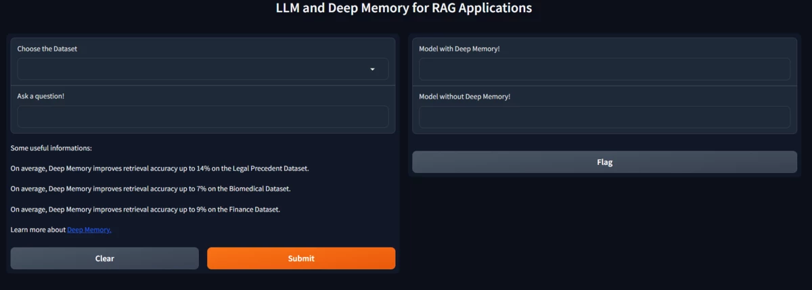

# Unlocking Advanced Retrieval Capabilities: LLM and Deep Memory for RAG Applications

Build a RAG System with LLM and Deep Memory. Use three different datasets and test the quality of response w/ and w/o the Deep Memory feature to improve retrieval!

Deep Memory emerges as a fundamental solution in addressing the critical need for accurate retrieval in generating high-quality results. It is crucial to increase the accuracy of Deep Lake’s vector search by up to 22%, achieved through learning an index from labeled queries tailored to specific applications. Importantly, this improvement is achieved without compromising research time, demonstrating the efficacy of Deep Memory in fine-tuning the retrieval process.

To run the project it is recommended to create a virtual environment and install the required packages:

```python
python -m venv venv
```

```python
source venv/bin/activate
```

```python
pip install -r requirements.txt
pip uninstall uvloop
```

Now that the system has been set up, you can run the Gradio interface and experiment with deep memory technology.

```python
python gradio_ui.py
```

Don't forget to set the API tokens as global variables by placing them in the .env file or passing them into the CLI using the `--credentials` argument.

## Learn more about datasets

In this project, there are three different datasets that could be downloaded and tested with and without the Deep Memory feature.

To find out more about them you can follow the links:

1) **Finance**: we chose the FinQA Dataset that contains text explaining the economy, acquisitions, etc. It also is a QA dataset, which makes it easier for us to embed as we already have questions and related answers without the need to generate them!
This work focuses on answering deep questions about financial data, aiming to automate the analysis of a large corpus of financial documents. In contrast to existing tasks in the general domain, the finance domain includes complex numerical reasoning and an understanding of heterogeneous representations.
Source: <https://github.com/czyssrs/FinQA>
2) **Legal**: the Legalbench Dataset contains questions and answers about legal subjects like the legal rights of a company, policies, and such. That is a very tedious and specific topic that is not readable by everyone, so retrieving the right information for this task is very welcome!
    LegalBench tasks span multiple types (binary classification, multi-class classification, extraction, generation, entailment), multiple types of text (statutes, judicial opinions, contracts, etc.), and multiple areas of law (evidence, contracts, civil procedure, etc.).
    It is a benchmark consisting of different legal reasoning tasks.

    Source: <https://huggingface.co/datasets/nguha/legalbench?clone=true>
3) **Biomedical**: To address a biomedical topic we chose the Cord19 Dataset, which is about Covid of course. As it is a very discussed topic, retrieving every possible information is crucial and so we wanted to test it.
CORD-19 is a corpus of academic papers about COVID-19 and related coronavirus research. It's curated and maintained by the Semantic Scholar team at the Allen Institute for AI to support text mining and NLP research.

    Source: <https://github.com/allenai/cord19>

## Interact through the Gradio interface

These three datasets are in the Activeloop organization space, so you need to load them in a Tensor Database format to be able to take advantage of the Deep Memory functionality.



The interface allows us to select the dataset we want to test, write a question, and instantly generate the answer.
We can also compare the response returned by the Deep Memory model with that returned by the model without.

## Evaluation Metrics

After testing out our datasets, we can see that the Deep Memory contribution is visible in retrieving more suitable information to the query provided as a question by the user.
The following metrics show how the **Deep Memory feature** can improve performance:

**Legal Dataset:**

```text
---- Evaluating without Deep Memory ----
Recall@1: 12.0%
Recall@3: 37.0%
Recall@5: 47.0%
Recall@10: 57.0%
Recall@50: 87.0%
Recall@100: 94.0%

---- Evaluating with Deep Memory ----
Recall@1: 19.0%
Recall@3: 56.0%
Recall@5: 66.0%
Recall@10: 79.0%
Recall@50: 88.0%
Recall@100: 95.0%
```

**Biomedical Dataset:**

```text
---- Evaluating without Deep Memory ----
Recall@1: 59.0%
Recall@3: 75.0%
Recall@5: 78.0%
Recall@10: 81.0%
Recall@50: 91.0%
Recall@100: 94.0%

---- Evaluating with Deep Memory ----
Recall@1: 69.0%
Recall@3: 81.0%
Recall@5: 83.0%
Recall@10: 86.0%
Recall@50: 97.0%
Recall@100: 98.0%
```

**Financial Dataset:**

```text
---- Evaluating without Deep Memory ---- 
Recall@1:         18.0%
Recall@3:         51.0%
Recall@5:         65.0%
Recall@10:        71.0%
Recall@50:        98.0%
Recall@100:       99.0%
---- Evaluating with Deep Memory ---- 
Recall@1:         26.0%
Recall@3:         66.0%
Recall@5:         75.0%
Recall@10:        81.0%
Recall@50:        99.0%
Recall@100:       99.0%
```
